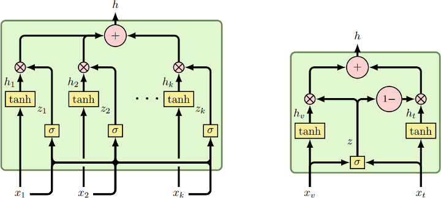

Source code for [Gated Multimodal Units for Information Fusion](https://openreview.net/forum?id=Hy-2G6ile).


# Dependencies
 * [Theano](https://github.com/Theano/Theano)
 * [Fuel](https://github.com/mila-udem/fuel)
 * [Blocks](https://github.com/mila-udem/blocks)
 
# Make dataset

You can download the ready-to-use Fuel format version: [multimodal_imdb.hdf5](http://lisi1.unal.edu.co/mmimdb/multimodal_imdb.hdf5) ([archive.org mirror](https://archive.org/download/mmimdb/multimodal_imdb.hdf5)) and [metadata.npy](http://lisi1.unal.edu.co/mmimdb/metadata.npy) ([archive.org mirror](https://archive.org/download/mmimdb/metadata.npy)).

Alternatively, you can build it manually:

 * Get the following files and uncompress it in the root folder of this project:
   * [MM-IMDb dataset](http://lisi1.unal.edu.co/mmimdb/mmimdb.tar.gz) ([archive.org mirror](https://archive.org/download/mmimdb/mmimdb.tar.gz))
   * [*word2vec*](https://drive.google.com/file/d/0B7XkCwpI5KDYNlNUTTlSS21pQmM/edit?usp=sharing) pretrained model
   * [*vgg*](https://drive.google.com/file/d/0B8MhA-4TrnTjR28xQkllMGx0aW8/view?usp=sharing) pretrained model
   * class names: [synsets_words.txt](https://raw.githubusercontent.com/sh1r0/caffe-android-demo/master/app/src/main/assets/synset_words.txt)

 * Create the `list.txt` file:
   ```
   ls dataset/*.json > list.txt
   ```
 * Run the make script:
   ```
   python3 make_dataset.py gmu.json
   ```
### Getting more movies
You can extend the dataset by adding more IMDb IDs to the `links.csv` file and run `get_data.py` script to crawl other movies.

# Train and eval the model
Generate random configurations:
```
python3 generators/gmu.py gmu.json
```
Train the model and then report performance in test set (e.g. best conf for GMU model #23):
```
python3 run.py json/gmu_23.json
```
